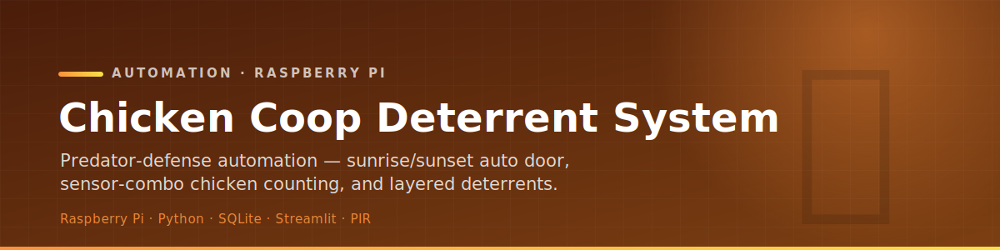
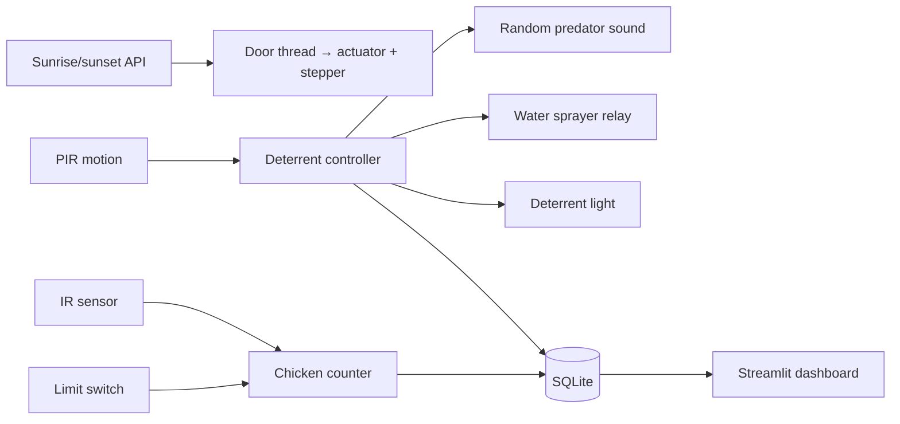

<p align="center">
  
</p>

<p align="center">
  
  
  
  
  
</p>

<p align="center">
  An automated Raspberry Pi system that protects a chicken coop from predators — opening and closing
  the door on sunrise/sunset, counting chickens with a sensor combo, and firing layered<br>
  audio, light, and water deterrents on motion, with everything logged to a Streamlit dashboard.
</p>

<p align="center">
  <i>TTU Microcontrollers Project Lab · Dennis Rivera · Saheel Faisal</i>
</p>

---

## ✨ What it does

- 🚪 **Auto door** — fetches today's sunrise/sunset times and drives a linear actuator + stepper
  motor to open at dawn and close at dusk, checked by a background thread every 30 s.
- 🐔 **Chicken counting** — a dual-sensor combo (IR **and** a limit switch firing within 2 s) counts
  a valid pass; single-sensor triggers are logged as invalid.
- 🦊 **Predator detection** — a PIR sensor continuously watches for motion.
- 🔊 **Layered deterrents** — on detection it plays a random predator sound (wolf, hawk, dog, eagle…),
  activates a water sprayer relay, and turns on a deterrent light.
- 🗄️ **Event logging** — all events are timestamped into a SQLite database.
- 📊 **Streamlit dashboard** — detection logs filtered by date plus an hourly detection trend chart.
- 🎛️ **Manual override** — open/close the door from a terminal interface.

## 🏗 Architecture



## 🔌 Hardware

| Component | Purpose |
| --------- | ------- |
| Raspberry Pi | Main controller |
| PIR sensor | Predator / motion detection |
| IR sensor + limit switch | Chicken entry/exit counting (combo) |
| Linear actuator + stepper (relay) | Coop door mechanism |
| Water sprayer (relay) | Deterrent spray |
| GPIO light | Deterrent light |
| Speaker | Audio deterrent playback |

## 🗂 Project structure

```text
├── main_system.py            # Entry point — runs all modules in threads
├── top_module.py             # High-level coordinator
├── sunset_sunrise_control.py # Sunrise/sunset API → door schedule
├── motion_sound_system.py    # PIR → audio deterrent
├── motion_light_controller.py# PIR → light deterrent
├── sprayer.py                # Water sprayer relay
├── relay_stepper_control.py  # Door stepper via relay
├── event_logger.py           # SQLite logging
├── ir_counter_day.py / limit_switch_day.py  # chicken counters
├── sounds/                   # 11 predator audio clips (.mp3)
├── web/dashboard.py          # Streamlit detection dashboard
└── requirements.txt
```

## 🚀 Setup & run

```bash
pip install -r requirements.txt     # RPi.GPIO, requests, playsound, streamlit, pandas, matplotlib

python main_system.py               # run the coop system
python manual_override.py           # manual door control
streamlit run web/dashboard.py      # monitoring dashboard
```

> Set GPIO pins to match your wiring (defined at the top of each module). SQLite `*.db` files are
> generated at runtime; the `sounds/` clips must be present for audio deterrents.

## 🧰 Stack

| Layer | Tech |
| ----- | ---- |
| Controller | Raspberry Pi, Python 3 (threaded) |
| Sensing | PIR, IR, limit switch |
| Actuation | Linear actuator, stepper, relays, sprayer, light, speaker |
| Data | SQLite event log |
| Dashboard | Streamlit + pandas + matplotlib |
| Scheduling | Live sunrise/sunset API |
